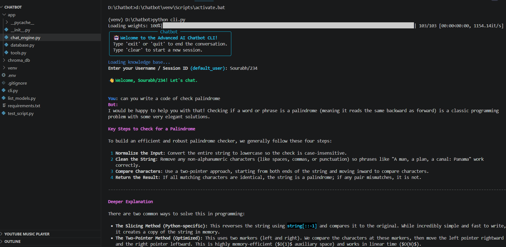
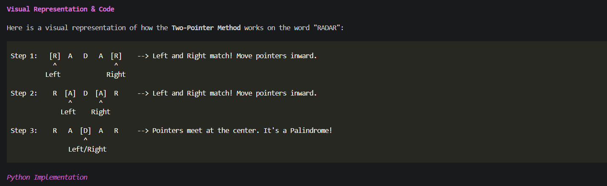
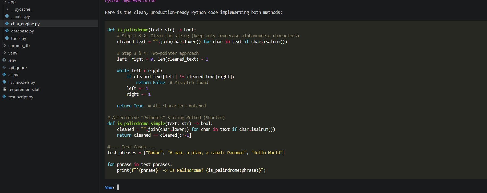
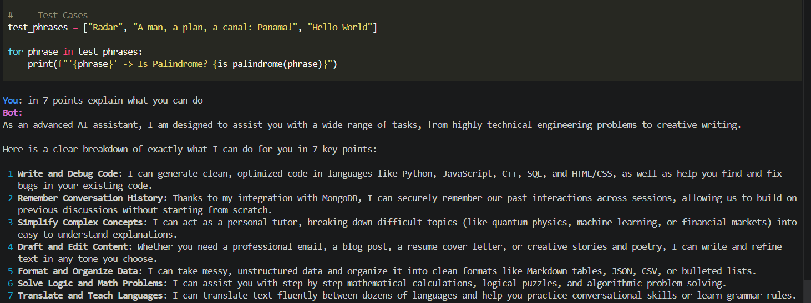
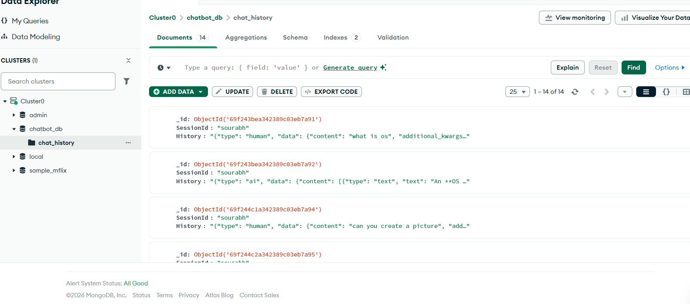

# 🤖 Advanced AI Chatbot CLI

A Python command-line chatbot that combines Google Gemini for responses, ChromaDB for local vector search, Hugging Face embeddings for semantic retrieval, and MongoDB Atlas for persistent chat history.

## ✨ Features

- 💬 Conversational CLI with session-based chat history
- 🧠 Google Gemini response generation
- 🍃 MongoDB Atlas persistence for conversations
- 🔎 ChromaDB vector storage for local knowledge retrieval
- 🤗 Hugging Face sentence-transformer embeddings
- 📄 PDF ingestion with the `/pdf` command
- 🌐 Web search helper with the `/search` command
- 🛟 In-memory fallback when MongoDB is unavailable

## 🧰 Tech Stack

- 🐍 Python
- 🔗 LangChain
- ✨ Google Gemini API
- 🍃 MongoDB Atlas
- 🗂️ ChromaDB
- 🤗 Hugging Face embeddings
- 🎨 Rich terminal UI

## 📁 Project Structure

```text
.
+-- app/
|   +-- chat_engine.py      # Gemini chain, MongoDB history, response generation
|   +-- database.py         # ChromaDB setup, embeddings, PDF ingestion
|   +-- tools.py            # DuckDuckGo web search helper
|   +-- __init__.py
+-- cli.py                  # Main command-line app
+-- list_models.py          # Lists available Gemini models
+-- test_script.py          # Basic setup test
+-- requirements.txt
+-- .env                    # Local secrets, not committed
```

## ⚙️ Setup

### 1. 🧪 Create and activate a virtual environment

```powershell
python -m venv venv
.\venv\Scripts\activate
```

### 2. 📦 Install dependencies

```powershell
pip install -r requirements.txt
```

### 3. 🔐 Create a `.env` file

Create a `.env` file in the project root:

```env
GOOGLE_API_KEY="your_google_gemini_api_key"

MONGODB_URI="your_mongodb_atlas_connection_string"
MONGODB_DB_NAME="chatbot_db"
MONGODB_COLLECTION_NAME="chat_history"

GEMINI_MODEL="gemini-3.5-flash"

HF_TOKEN="your_optional_huggingface_token"
HUGGINGFACEHUB_API_TOKEN="your_optional_huggingface_token"

CHROMA_PERSIST_DIR="./chroma_db"
ANONYMIZED_TELEMETRY=False
CHROMA_USER_TELEMETRY_DISABLED=TRUE
```

Do not commit `.env`. It contains private API keys and database credentials.

## 🍃 MongoDB Atlas Setup

1. Create a MongoDB Atlas account.
2. Create a free cluster.
3. Go to **Database Access** and create a database user.
4. Go to **Network Access** and add your current IP address.
5. Go to **Database > Connect > Drivers**.
6. Copy the connection string that starts with `mongodb+srv://`.
7. Paste it into `.env` as `MONGODB_URI`.

The database and collection can stay as:

```env
MONGODB_DB_NAME="chatbot_db"
MONGODB_COLLECTION_NAME="chat_history"
```

MongoDB will create them automatically after the first saved chat message.

## 🚀 Run the Chatbot

```powershell
.\venv\Scripts\python.exe cli.py
```

Or, if the virtual environment is already activated:

```powershell
python cli.py
```

## 💻 CLI Commands

| Command | Description |
| --- | --- |
| `exit` or `quit` | 🛑 Stop the chatbot |
| `clear` | 🔄 Start a new session ID |
| `/pdf path\to\file.pdf` | 📄 Add PDF text to the knowledge base |
| `/search your query` | 🌐 Search the web and ask the bot using the results |

## ✅ Test the Setup

Run:

```powershell
.\venv\Scripts\python.exe test_script.py
```

To list Gemini models available for your API key:

```powershell
.\venv\Scripts\python.exe list_models.py
```

## 🔌 How to Check MongoDB Connection

When MongoDB is not connected, the app prints a warning like:

```text
Warning: Could not connect to MongoDB
Using in-memory chat history. History will NOT persist across restarts.
```

If that warning does not appear after sending a message, MongoDB is connected.

You can also check Atlas:

1. Open MongoDB Atlas.
2. Go to **Database**.
3. Click **Browse Collections**.
4. Open `chatbot_db`.
5. Open `chat_history`.

## 🖼️ Screenshots

Put screenshots in:

```text
docs/screenshots/
```

Recommended filenames:

```text
docs/screenshots/chatbot-start.png
docs/screenshots/chatbot-response.png
docs/screenshots/mongodb-atlas-history.png
```

Then add them here:

### 🚀 Chatbot Start



### 💬 Chatbot Response



### 💬 Chatbot Response



### 💬 What Can It do



### 🍃 MongoDB Chat History



If an image does not show on GitHub, check that the filename and extension match exactly.

## ⚠️ Common Warnings

### 🤗 Hugging Face unauthenticated warning

```text
Warning: You are sending unauthenticated requests to the HF Hub.
```

This is not fatal. Add `HF_TOKEN` and `HUGGINGFACEHUB_API_TOKEN` to `.env` if you want higher rate limits and fewer warnings.

### ✨ Gemini 503 unavailable

```text
503 UNAVAILABLE
This model is currently experiencing high demand.
```

This usually means the Gemini model is temporarily overloaded. The project uses `GEMINI_MODEL` from `.env`, so you can switch models without editing code.

## 📝 Notes

- 🗂️ `chroma_db/` stores local vector data and is ignored by Git.
- 🔐 `.env` is ignored by Git because it contains secrets.
- 🍃 MongoDB is used for chat history, while ChromaDB is used for semantic knowledge retrieval.
